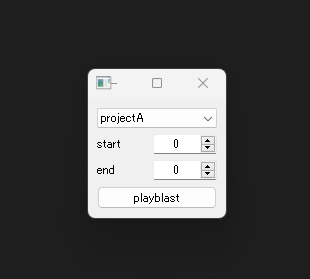

This is a conceptual tool for our open-source project, Puzzle2 and Sticky.  
This tool is designed to simulate playblasts but can not used in maya. 

Please run it as a standalone application.


# Instrallation

set current directory to your location

```
git clone git@github.com:hat27/PzPlayblast.git PzPlayblast; cd PzPlayblast

mkdir pipenv; cd pipenv
pipenv install --python 3.x
pipenv shell
cd ../
pip install -r requirement.txt

# run tool
python src/PzPlayblast/form/main.py
```



### to use

change project, start, end then push "playblast".  

# [Sticky](https://github.com/hat27/Sticky)

"Sticky" is a module for merging several configurations.
In the case of this tool, I made configuration files below.
files are created under sample/env folder.


**project configs:**
There 2 projects and 1 variation for projectA
- projectA.v1.yml
- projectA.ep01.v1.yml
- projectB.v1.yml


**tool configs:**
default config for PzPlayblast and variations below 
- PzPlayblast.v1.yml
- PzPlayblast.projectA.v1.yml
- PzPlayblast.projectA.ep01.v1.yml
- PzPlayblast.projectB.v1.yml


For example, when you set projectA

**relative config files are:**
- base.v1.yml (parent: none)
- base.v2.yml (parent: base.v1.yml)
- projectA.v1.yml (parent: base.v2.yml)
- PzPlayblast.projectA.v1.yml (parent: none)

project configs and tool configs are different tree but 
it will join togather finally.


# [Puzzle2](https://github.com/hat27/Puzzle2)
"Puzzle2" is a pipeline framework for any type of python scripts.

[document](https://hat27.github.io/puzzle2/)

When you press the "playblast" button, then puzzle2 will take care after that.

I made 5 tasks
- CreateModelPanel
- Playblast
- RemovePanel
- SetFrames
- SetHud
  
most of them are just dummy.   

**but "SetFrames" task is like this:**
```
    if start_frame == 0 and end_frame == 0:
        new_start_frame = 1
        new_end_frame = 100
```

This task modifies the start frame and end frame when both of them are 0. 
If this tool can be used in Maya, I would code it like this.

```
    if start_frame == 0 and end_frame == 0:
        new_start_frame = cmds.playbackOptions(q=True, min=True)
        new_end_frame = cmds.playbackOptions(q=True, max=True)
```

Anyway, in this tool, when 0~0 is going to be the default value

## PzPlayblast Story

In Project A, we needed to create a playblast tool, so I created PzPlayblast for animators.  
The tool has 2 inputs(start, end) and execute button labels "playblast"   

**I designed the tasks(playblast button process) as follows:**
```
1. Create a model panel
2. Playblast
3. Remove the model panel
```

When Project A started, an animator mentioned that "when I set start and end frames to 0,  
movie was not created!"  

So, I added a skip code to the "Playblast" task to prevent this issue from happening again.

Pre-production ended, and production started.  
The director requested, "I want to see the HUD in the preview."

Then, I created and added a "SetHud" task. 
I wondered if I could add this to the default, but I decided to add it to a new configuration,
"PzPlayblast.projectA.ep01.v1.yml". 

**The tasks in this configuration are as follows:**
```
1. Create a model panel
2. Set the HUD
3. Playblast
4. Remove the model panel
```

As time went by, Project B started, and an animator from Project A asked me,  

"Is it possible to change the behavior of the playblast tool when the start and end frames are 0-0?
Maybe setting the zoom bar to default is much better than now. 
Also, we want to save the playblast movies to another location."

First, I created a "SetFrames" task and added it to "PzPlayblast.projectB.v1.yml".   

At first, I forgot to add "data_key_replace" to "playblast," so it didn't work well. 
But once I added "data_key_replace," everything went well. 

**The tasks in Project B are as follows:**

```
1. Set frames
2. Create a model panel
3. Set the HUD
4. Playblast
5. Remove the model panel
```

Then, I added a new value for the "output path" to "PzPlayblast.projectB.v1.yml".  
This works to change output location.

In the end, PzPlayblast became an essential tool for the animation team, 
saving them time and effort during the production process. 

Additionally, Sticky and Puzzle have made my development work much easier.

Today, 
Project C started, and a new request came in: 
"Hey, we need a new tool which does the same thing for 100 files!"

I'm currently working on this, but I'm thinking of creating a GUI to list the files and 
adding an "Open File" task at the beginning. :) 
